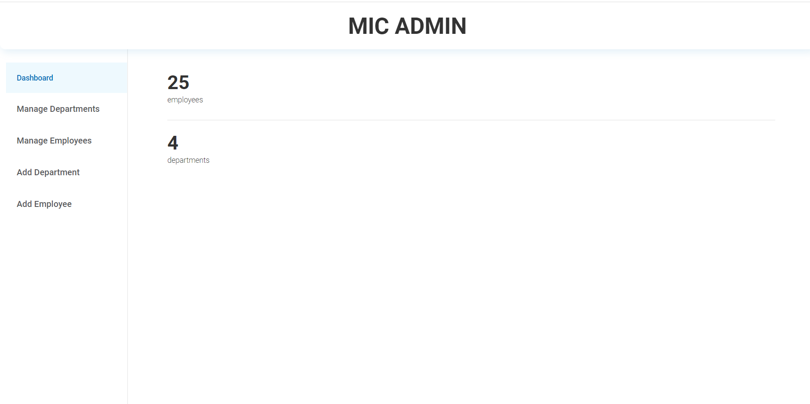
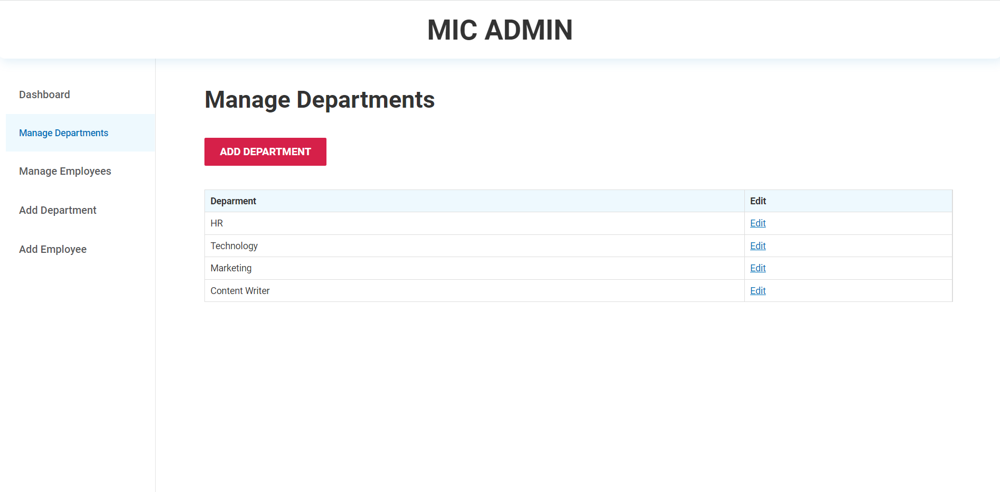
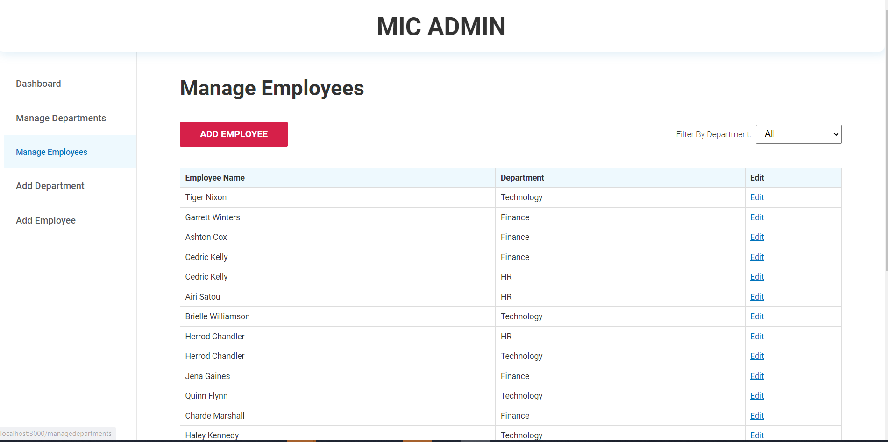
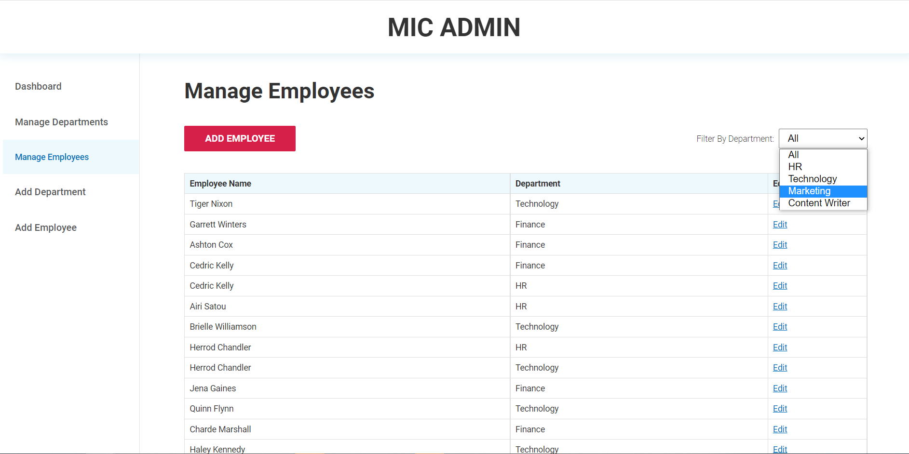
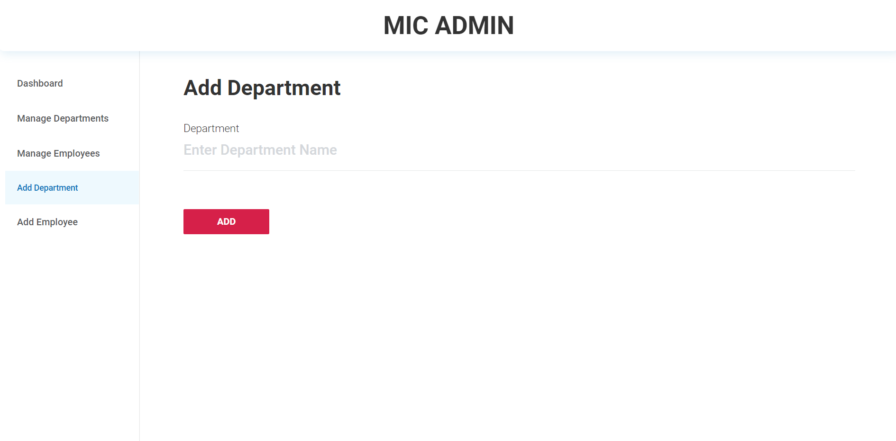
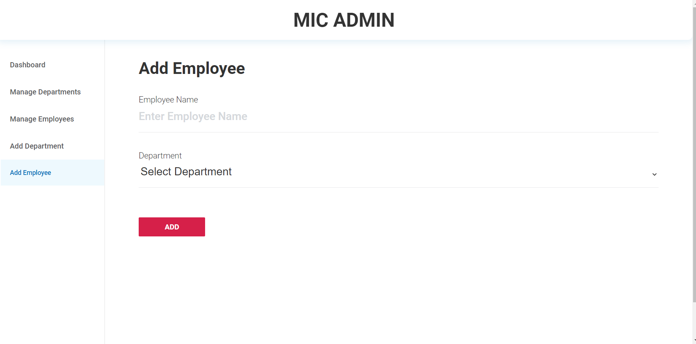
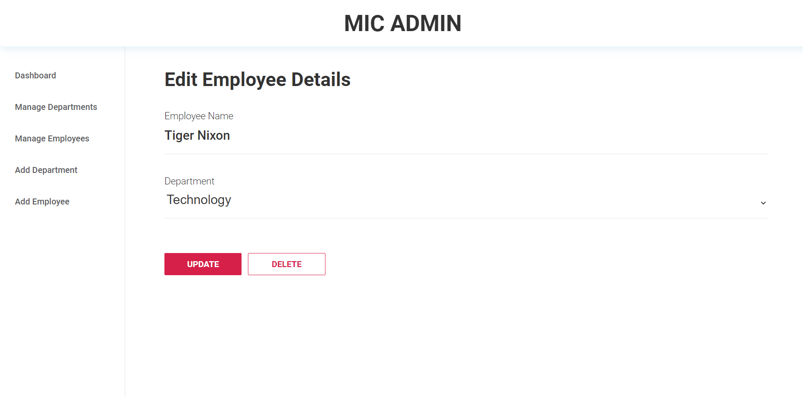
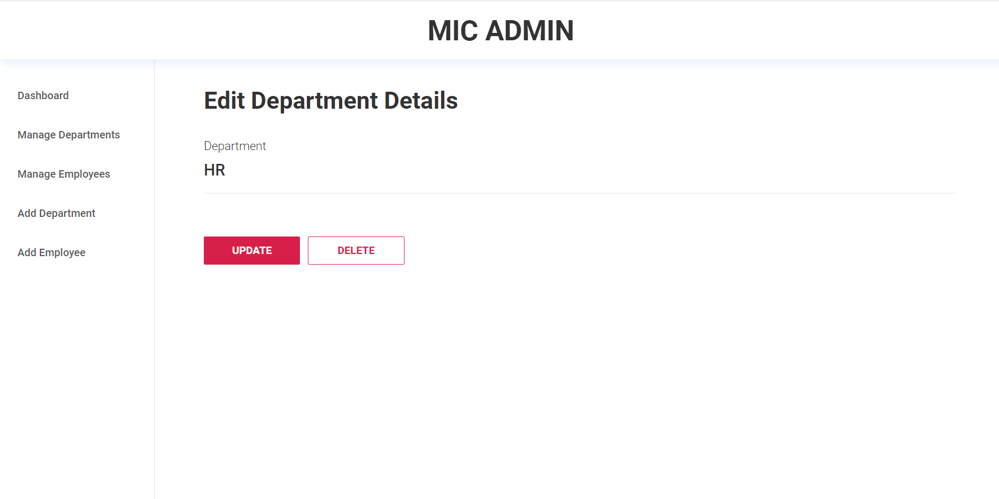

# MIC ADMIN APP

A REACT app for managing employees and departments making a bit easier for managment team. Used various react hooks useEffect, useState, useHistory. Also created custom hook called `useFetch` for ajax call using fetch API. Used json-server to implement a fake REST API (data persistency).
An app to perform CRUD operations on data. Filter employees based on a department.
<br><br>

---
<br>

## To run the project
In the project directory, you can run:

```sh
npm install 
```
To install all the dependencies.
<br><br>

```sh
npm run dev
```
To run the project. \
Open [http://localhost:3000](http://localhost:3000) to view it in the browser.
<br><br>

---
<br>

## Technology Used:
* HTML5
* CSS3
* Javascript
* React JS
<br><br>

---
<br>

## Features
* Dashboard: Displays total employees and departments
<br><br>

<br>

* Manage / View Departments
<br><br>

<br>

* Manage / View Employees
<br><br>

<br>

* Filter employees based on department
<br><br>

<br>

* Add Department
<br><br>

<br>

* Add Employee
<br><br>

<br>

* Update / Delete Employee
<br><br>

<br>

* Update / Delete Department
<br><br>

<br><br>


---
<br>

Developer: `Aditya Parab`

